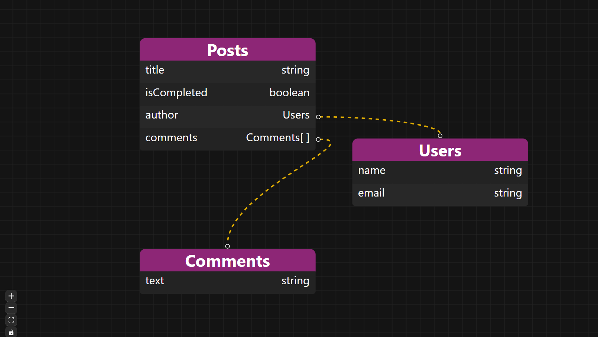

# Convex Schema Visualizer




### Easy to use, the component `ConvexSchemaViz` is mostly self-contained!

Make sure you grab the `types.d.ts` and the `TableNode` component. Usage below.


```js
import { ConvexSchemaViz } from "@/components/convex-schema-viz";

function App() {
  return (
    <>
      <ConvexSchemaViz />
    </>
  );
}

export default App;

```

